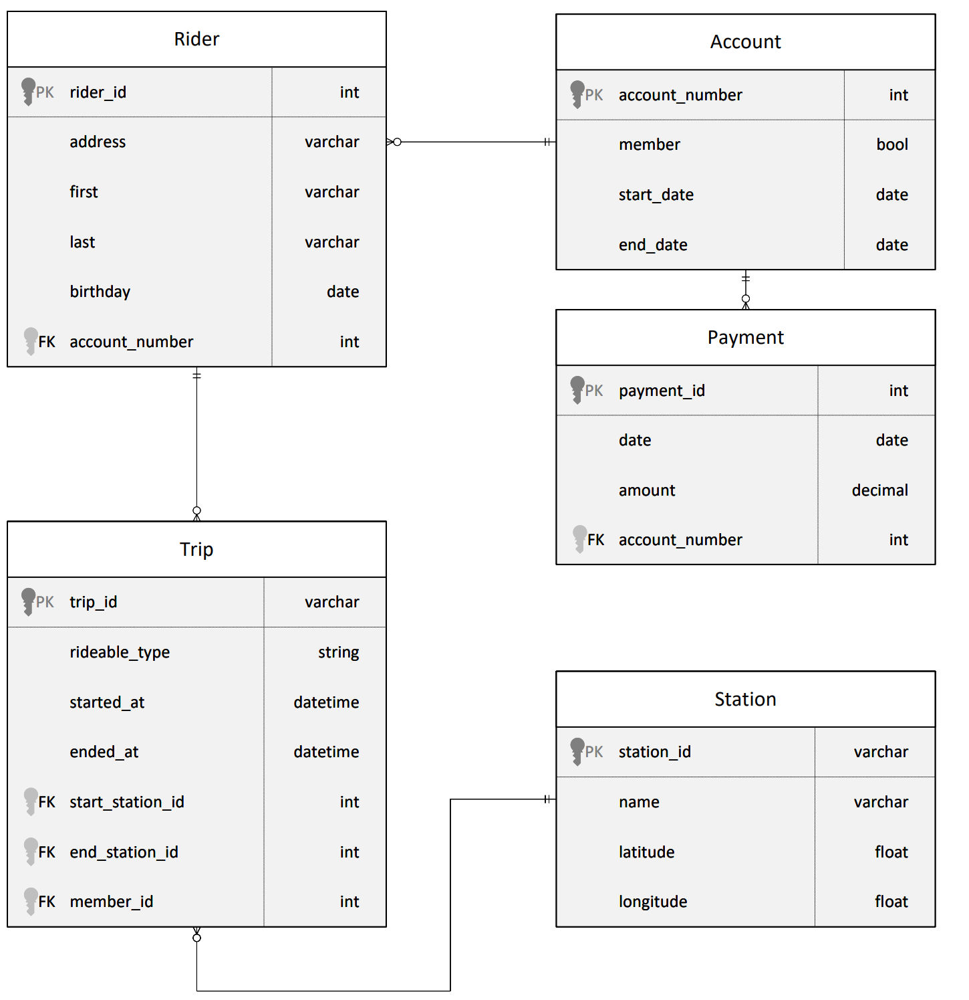

# Azure Data Lake for Bike Share Data Analytics
- `assets`: This folder includes screenshots that provide proof of task completion, including on the EXTRACT section.
- `data`: This directory contains raw CSV files for `publicdate`, `payments`, `riders`, `stations`, and `trips`.
    - For the `publicdate.csv` file, it based on `payments.csv` using python script `create_publicdate.py`.
- `notebooks`: This folder contains the Python (Pyspark) notebooks used to extract, load, and transform steps.
- `solutions`: This folder documents the solutions for tasks 1 through 4. Each task is addressed in detail, with explanations, code, and methodology used to achieve the project’s outcomes.

## Project Overview
- The dataset looks like this

- The goal of this project is to develop a data lake solution using Azure Databricks using lake house architecture:
    - Design a star schema based on the business outcomes
    - Import the data into Azure Databricks using Delta Lake to create a Bronze data store.
    - Create a gold data store in Delta Lake tables.
    - Transform the data into the star schema for a Gold data store.

**The business outcomes you are designing for:**
1. Analyze how much time is spent per ride
    - Based on date and time factors such as day of week and time of day
    - Based on which station is the starting and / or ending station
    - Based on age of the rider at time of the ride
    - Based on whether the rider is a member or a casual rider
2. Analyze how much money is spent
    - Per month, quarter, year
    - Per member, based on the age of the rider at account start
3. EXTRA CREDIT - Analyze how much money is spent per member
    - Based on how many rides the rider averages per month
    - Based on how many minutes the rider spends on a bike per month