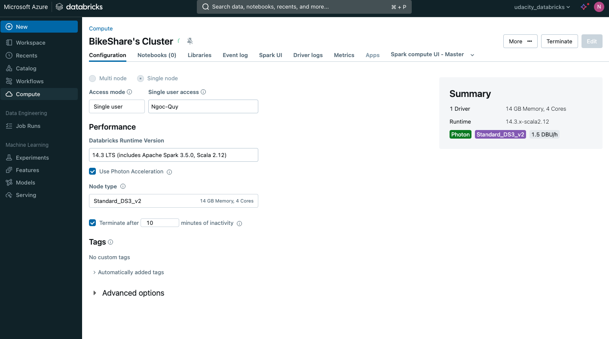

# Task 2: Extract Step
- Create the Azure Databricks resource

- Create Databricks Cluster

- Upload the CSV files to DFBS

- Write the dataset into Bronze store with Delta format.

- The Python notebook for extracting data from raw to  Delta file system
    - [extract.ipynb](../notebooks/extract.ipynb)