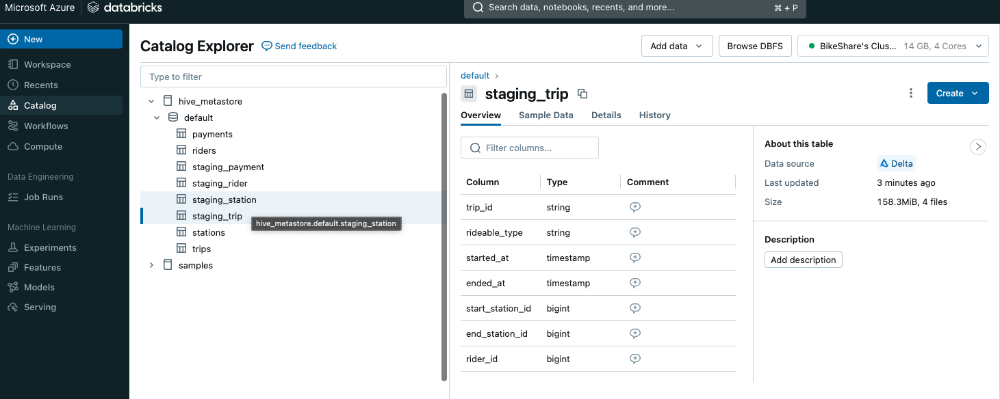

# Task 3: Load Step 
**Implement key features of data lakes on Azure**
- The Python notebook for loading data from Delta file system to create staging tables:
    - [load.ipynb](../notebooks/load.ipynb)
- Verify all 4 staging tables are loaded in the Delta lake.

