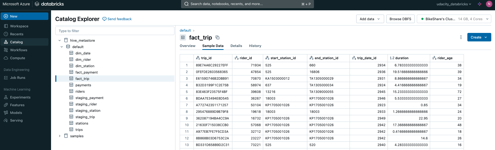

# Task 4: Transform Step 
**Transform the data following Star Schema for Gold Data Store**
- The Python notebook (ELT processs with PySpark) for making fact and dim tables:
    - [transform.ipynb](../notebooks/transform.ipynb)

