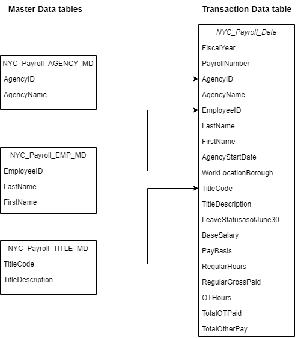

# NYC Payroll Data Analytics Pipelines
- `assets`: This folder includes screenshots that provide proof of task completion.
- `data`: This directory contains raw CSV files for NYC Payroll project.
- `scripts`: This folder contains the SQL scripts used to making ETL process.
- `solutions`: This folder documents the solutions for each tasks. Each task is addressed in detail, with explanations, code, and methodology used to achieve the project’s outcomes.

## Project Overview
The City of New York would like to develop a Data Analytics platform on Azure Synapse Analytics to accomplish two primary objectives:
- Analyze how the City's financial resources are allocated and how much of the City's budget is being devoted to overtime.
- Make the data available to the interested public to show how the City’s budget is being spent on salary and overtime pay for all municipal employees.

