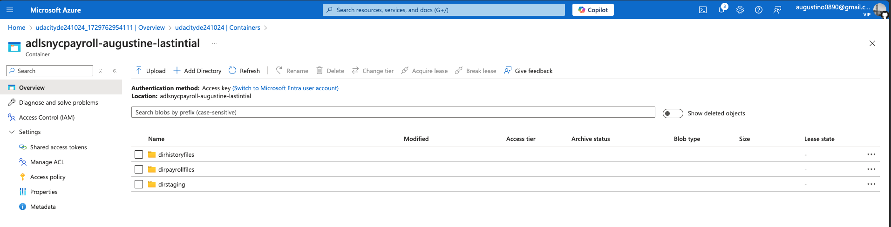
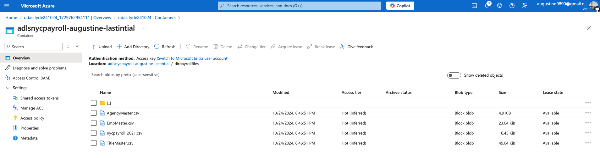
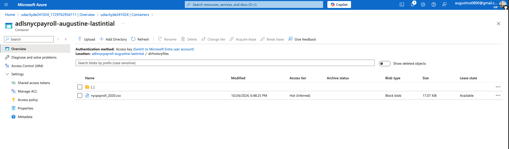
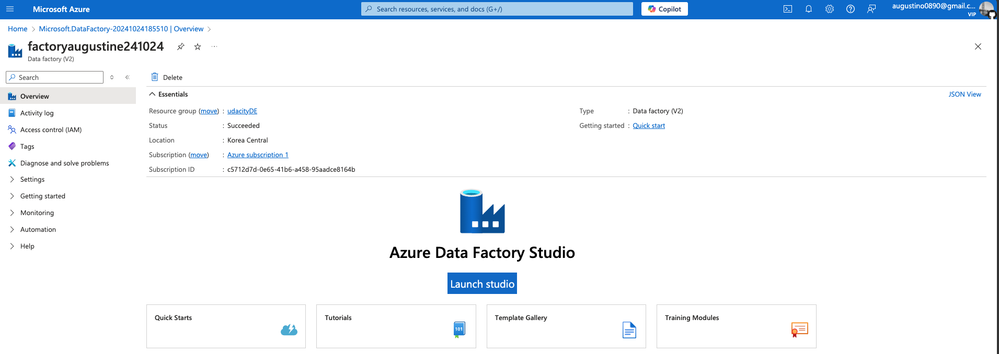
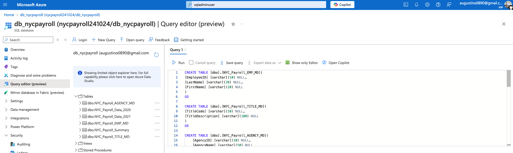
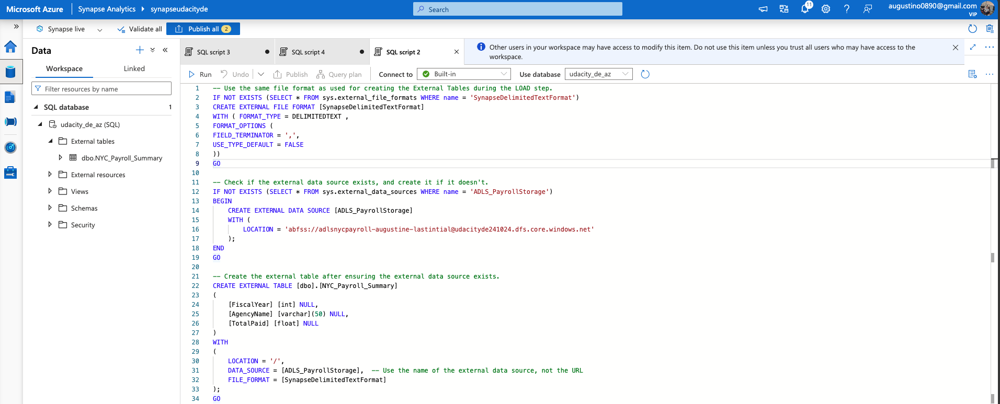

### 1. Create data lake and upload data
- Create an Azure Data Lake Storage Gen2 (storage account) and associated storage container resource named `adlsnycpayroll-{yourfirstname}-lastintial`.
- Create three directories in this storage container named:
    - `dirpayrollfiles`
    - `dirhistoryfiles`
    - `dirstaging`
- Upload these files from the project data to the `dirpayrollfiles` folder:
    - `EmpMaster.csv`
    - `AgencyMaster.csv`
    - `TitleMaster.csv`
    - `nycpayroll_2021.csv`
- Upload this file (historical data) from the project data to the `dirhistoryfiles` folder:
    - `nycpayroll_2020.csv`

### 2. Create an Azure Data Factory Resource

### 3. Create master data tables and payroll transaction tables in SQL DB

### 4. Create summary data external table in Synapse Analytics workspace
