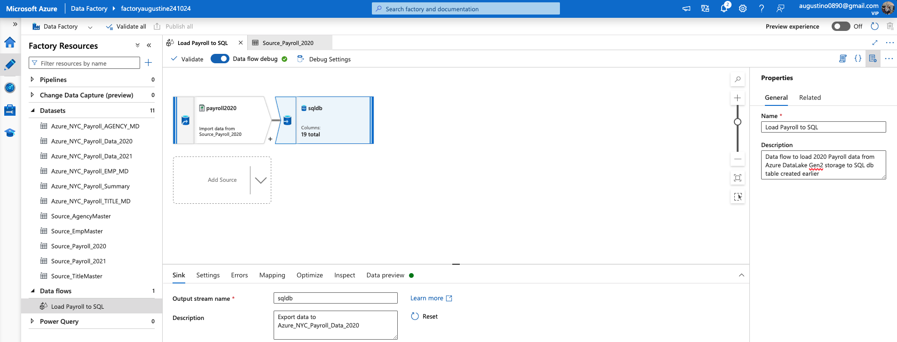
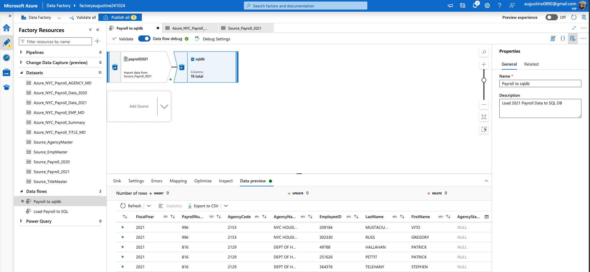
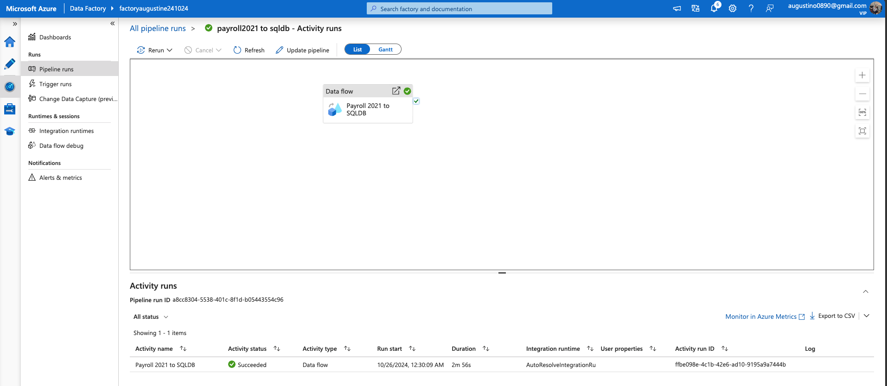
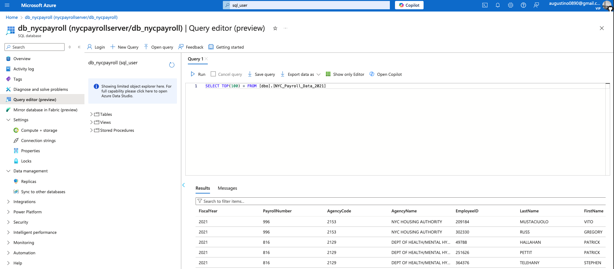
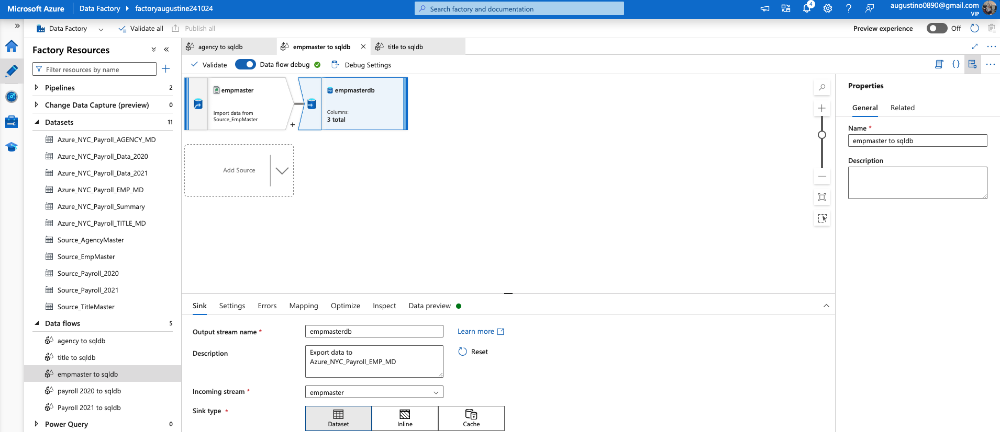
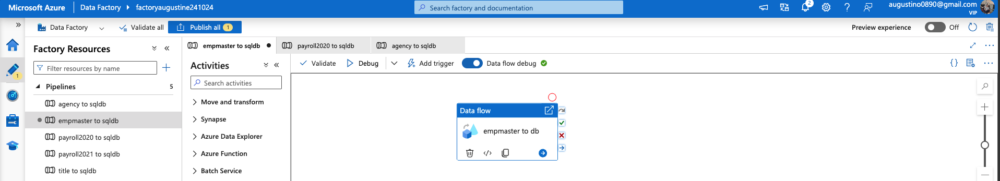
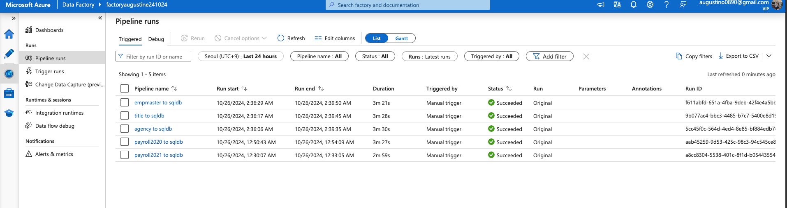
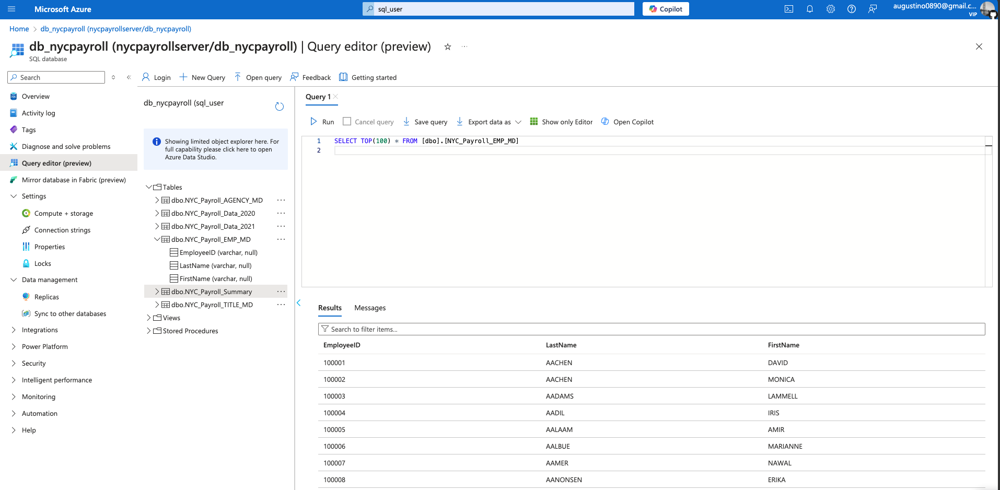

**Create Data Flows and Pipelines**
1. Data flow to load 2020 Payroll data from Azure DataLake Gen2 storage to SQL db table 

2. Load 2021 Payroll Data to SQL DB transaction table

3. Create Pipeline to load 2021 Payroll data into the SQL DB

4. Create data flows load data from data lake into SQL DB
- Design data flows to load Employee, Title, and Agency files into their respective SQL pool tables on SQL DB.
- For each data flow, ensure the data is directed to the corresponding SQL DB target table as the sink.

5. Create pipelines for Employee, Title, Agency to SQL DB containing the data flows

