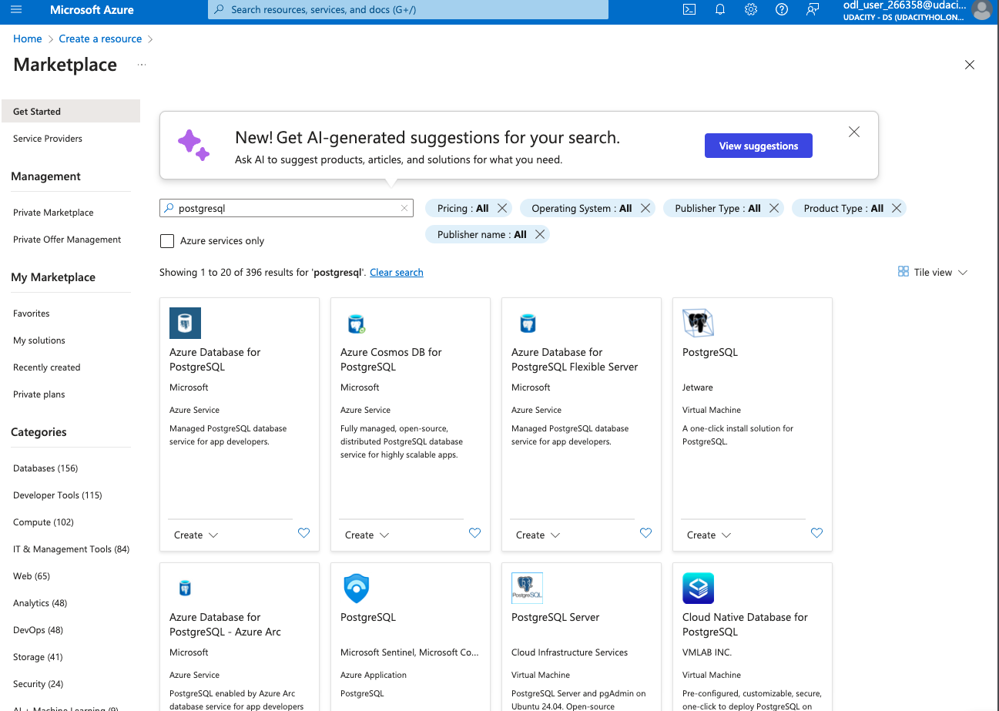
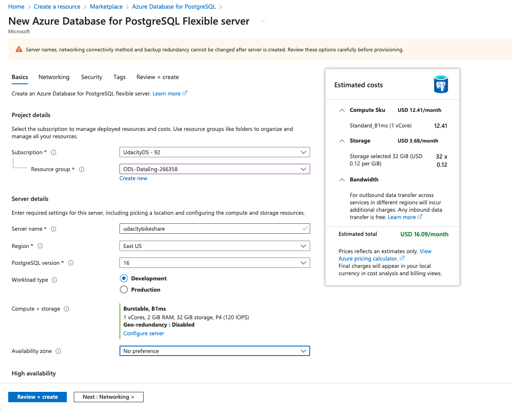
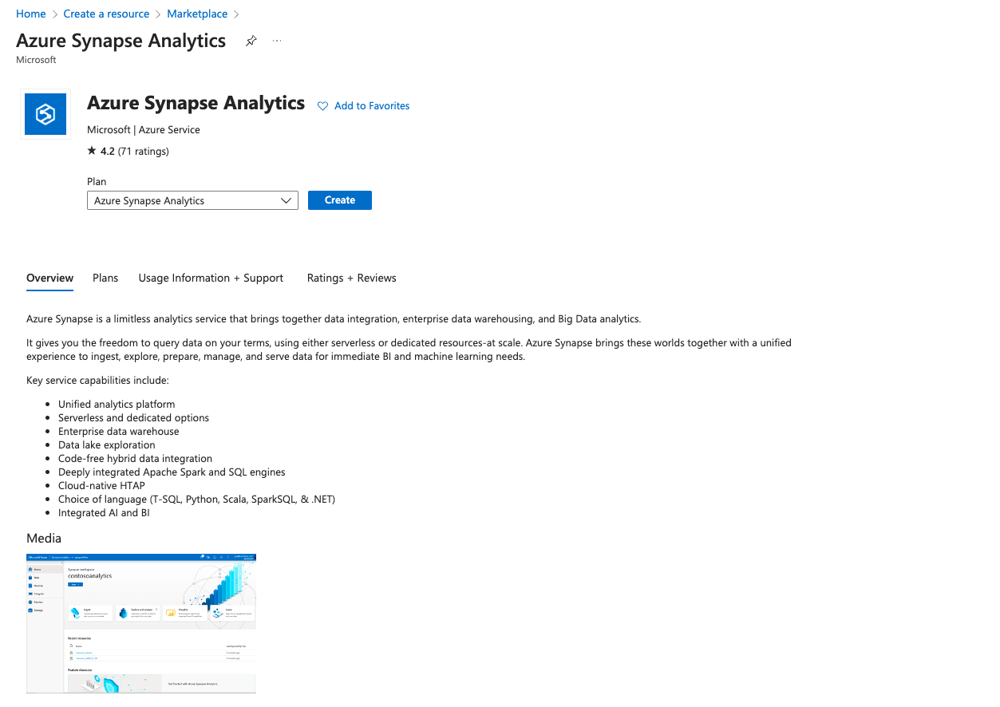
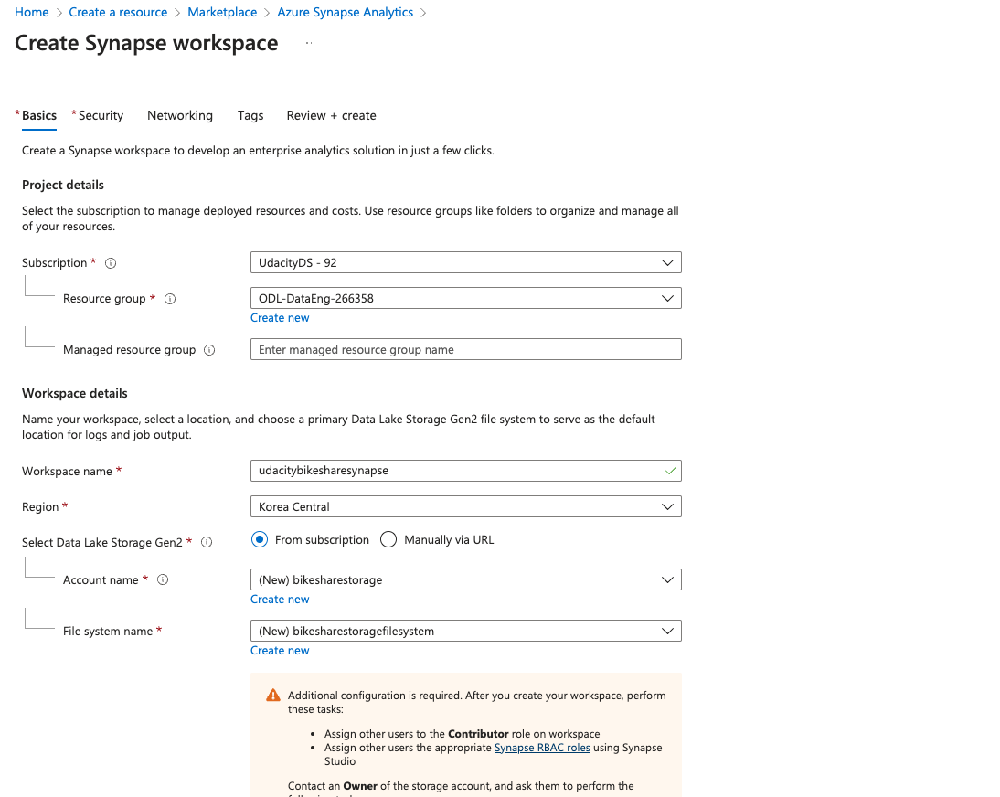
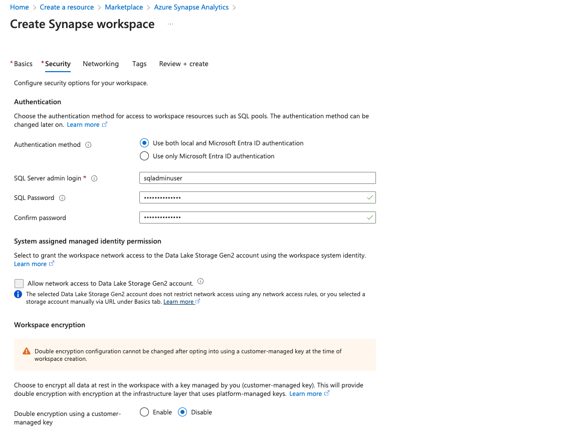
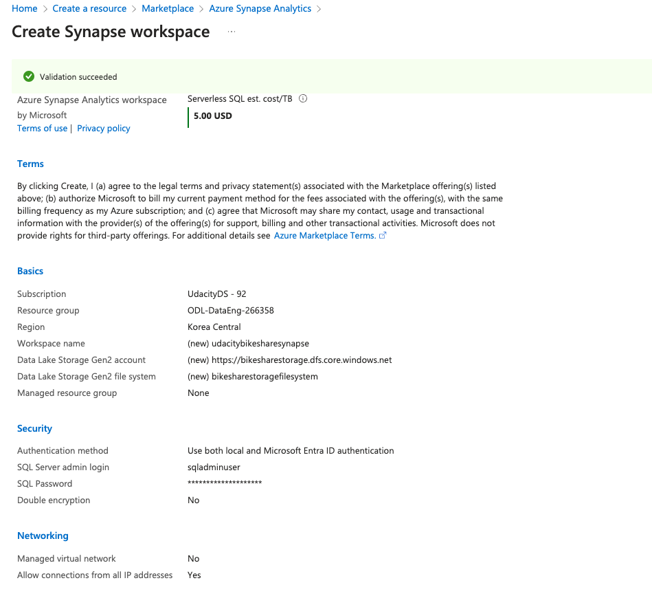
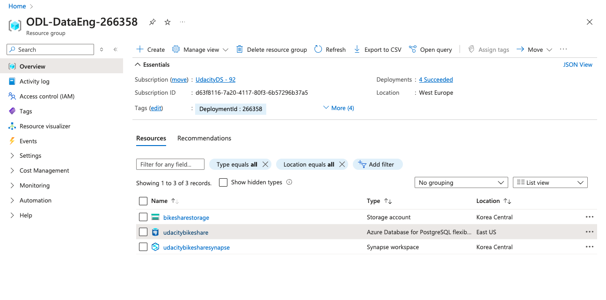
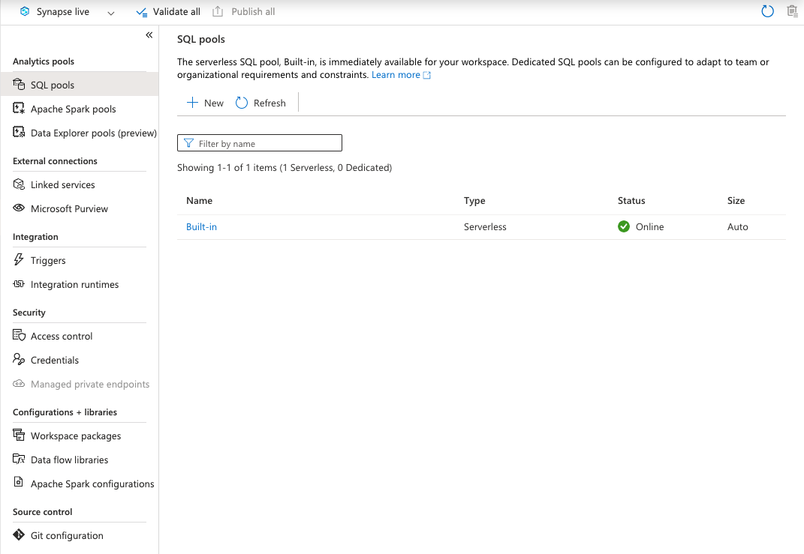

# Task 1: Create your Azure Resource
- Create an Azure Database for PostgreSQL

- Create an Azure Synapse workspace

- Azure Resource Group

- Use the built-in serverless SQL pool and database within the Synapse workspace

