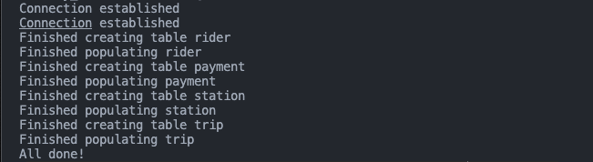
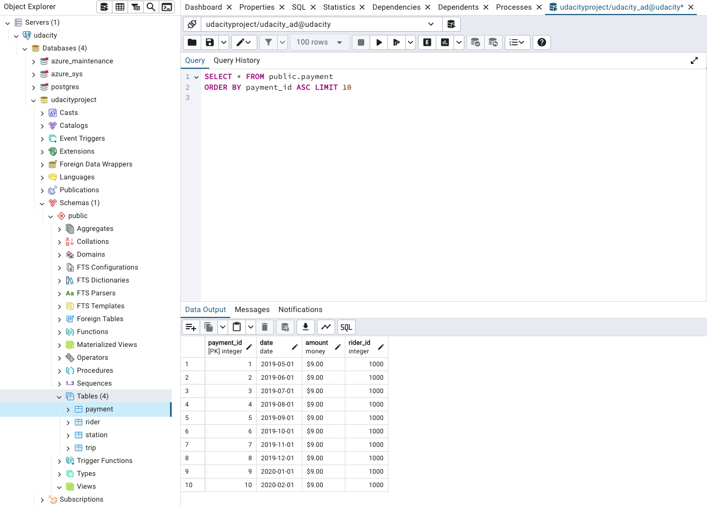

# Task 3: Create the Data in PostgreSQL
- Put the all the data in the folder `./data/` and run the python script `data_to_postgres.py` (modified based on `ProjectDataToPostgre.py`)
- Run python script using `poetry`
    - `poetry run python data_to_postgres.py`

- Check with `pgadmin`

