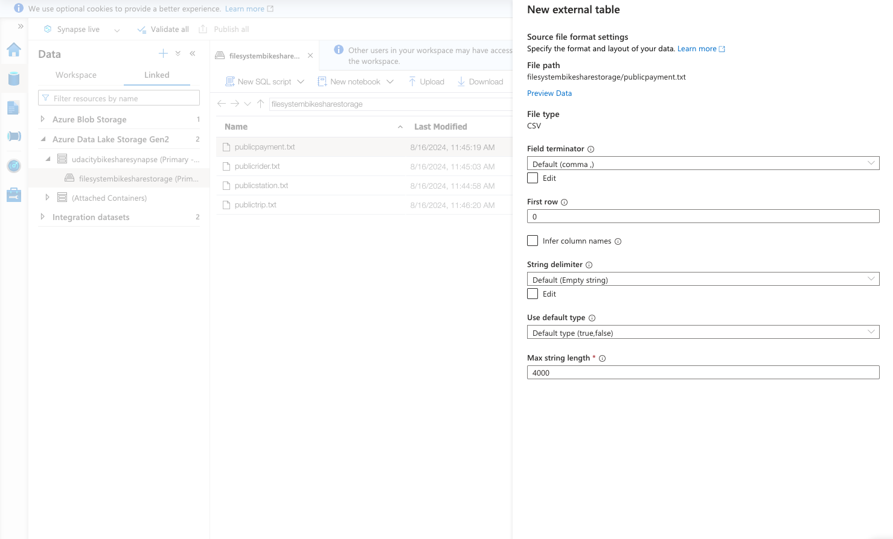
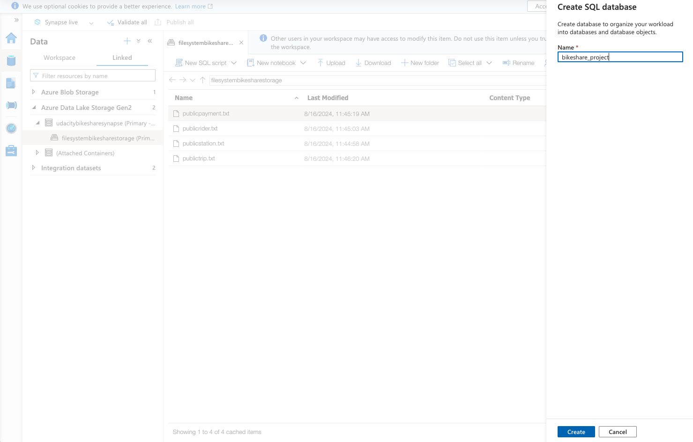
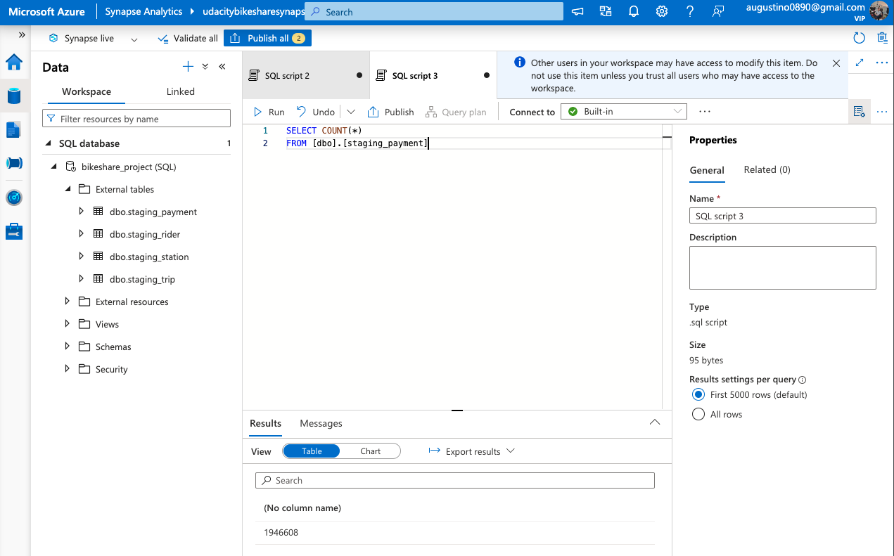

# Load data from Azure Blob Storage into External tables
- Create external tables

- SQL Scripts for creating staging external tables: 
    - [staging_payment.sql](../scripts/staging_payment.sql)
    - [staging_rider.sql](../scripts/staging_rider.sql)
    - [staging_station.sql](../scripts/staging_station.sql)
    - [staging_trip.sql](../scripts/staging_trip.sql)