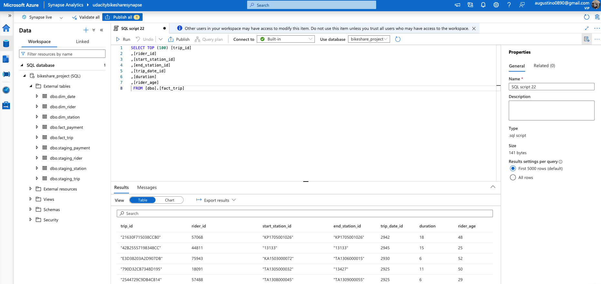

# Task 6: TRANSFORM the data to the Star schema using CETAS
- Create external `dim_date` table based on `payments.csv` using python script `create_publicdate.py`.
    1. Read the `payments.csv` file.
    2. Extract the minimum and maximum dates.
    3. Generate a sequence of dates between the minimum and maximum dates.
    4. Create the `publicdate.csv` file with the required columns.
- SQL Script for creating `dim_date` external tables:
    - [dim_date.sql](../scripts/dim_date.sql)
- SQL Script for creating `dim_rider` external tables:
    - [dim_rider.sql](../scripts/dim_rider.sql)
- SQL Script for creating `fact_payment` external tables:
    - [fact_payment.sql](../scripts/fact_payment.sql)
- SQL Script for creating `fact_trip` external tables:
    - [fact_trip.sql](../scripts/fact_trip.sql)

